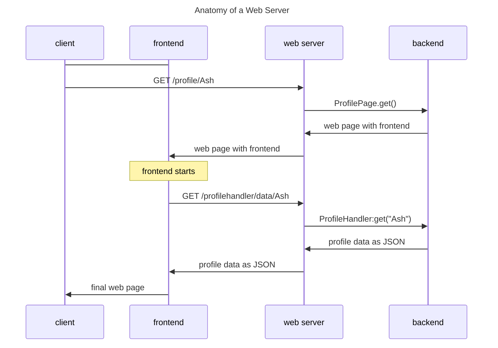

** Note to developers:

> This Wiki will be updated as we scale our code base. We are currently in our initial phase, so we don't have much to explain. However, as the number of files and folder increases, this wiki will be updated simultaneously.

## Table of Contents

* [Web server anatomy: Explaining "frontend" and "backend"](#web-server-anatomy-explaining-frontend-and-backend)

Ambu's backend is written in [Python](https://www.python.org/), and its frontend is written using Vanilla JavaScript.

## Web server anatomy: Explaining "frontend" and "backend"

If you aren't too familiar with web servers, you might be wondering what terms like "frontend" and "backend" mean. Here's a quick primer.

Suppose you want to view the profile page of the Ambu user `Ash`, so you point your browser to `/profile/Ash`. This diagram illustrates what happens:

First, your browser (the client) sends a request to Ambu's web server for the path `/profile/Ash`. The webserver passes this request to the appropriate handler function in the backend code. The backend code responds with a web page that contains the frontend code, which the web server passes along to your browser.

Now the frontend code starts running in your browser and, in this example, requests additional data from the web server by issuing a request for the `/profilehandler/data/Ash` path. Once again, the web server passes this request to the appropriate backend function, which responds. This time however, the response is [JSON-formatted data](https://developer.mozilla.org/en-US/docs/Learn/JavaScript/Objects/JSON), not a web page. This JSON data is passed to the frontend. The JSON data is not very readable, but you can see it by navigating to http://localhost:8181/profilehandler/data/Ash.

While all these operations have been running, your browser has been showing a loading page. Now, the frontend code uses the profile JSON data to create the final web page, which you then see.

For most websites, including Ambu, backend code runs on the server and does most of the site's complicated logic. It works with information and mostly ignores how that information will be conveyed to the user.

On the other hand, frontend code runs in the user's browser and doesn't handle much logic. Instead, it is responsible for conveying the information from the backend to the user and passing user commands to the backend.
